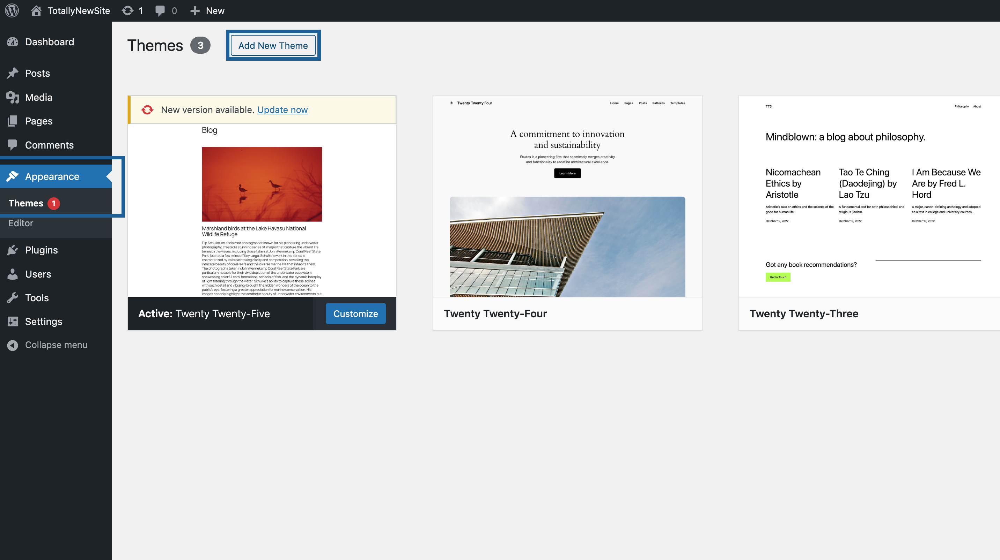
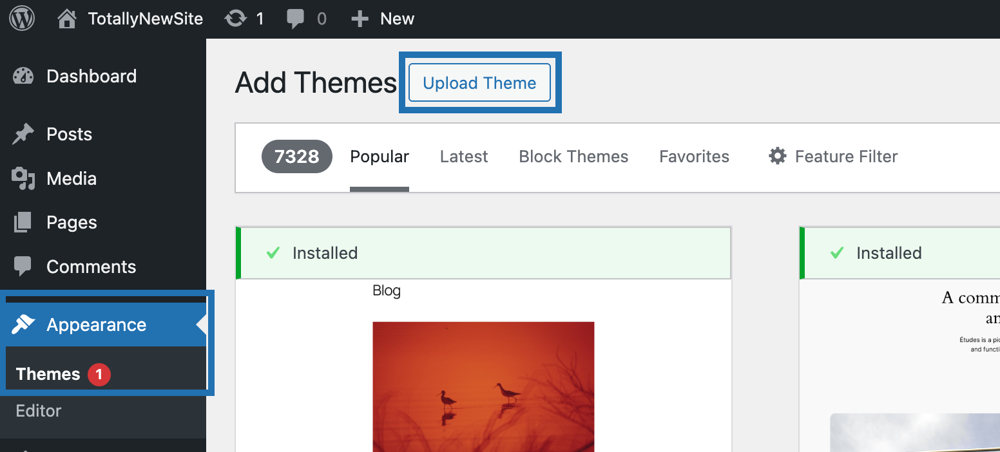
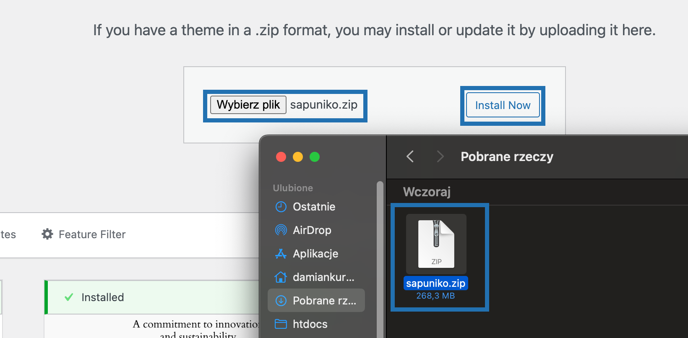
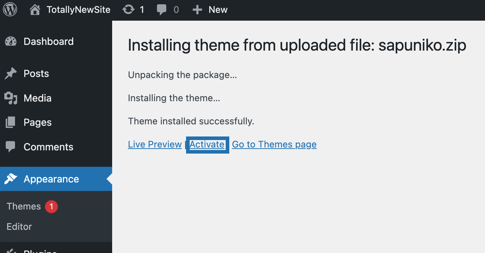

# Install & Activate Theme

Congratulations on purchasing the Sapuniko theme! Let's set it up.

## Step 1: Download the Theme

Download the Sapuniko theme zip file from the Sapuniko ThemeForest page.

Don't extract it, the theme should be activated as a **zip file**.

## Step 2: Upload the Theme

In Your WordPress admin panel navigate to **Appearance -> Themes**.

 
Click **Add New Theme**.
 

 
Afterwards, click **Upload Theme**.
 

 
Next, upload the theme zip folder.

After uploading, click **Install Now**. This should take up to a minute.
 

 

## Step 3: Activate the Theme

After installation you can activate the theme right away by clicking on **Activate**.

Alternatively, browse to **Appearance -> Themes** and activate Your theme from there.
