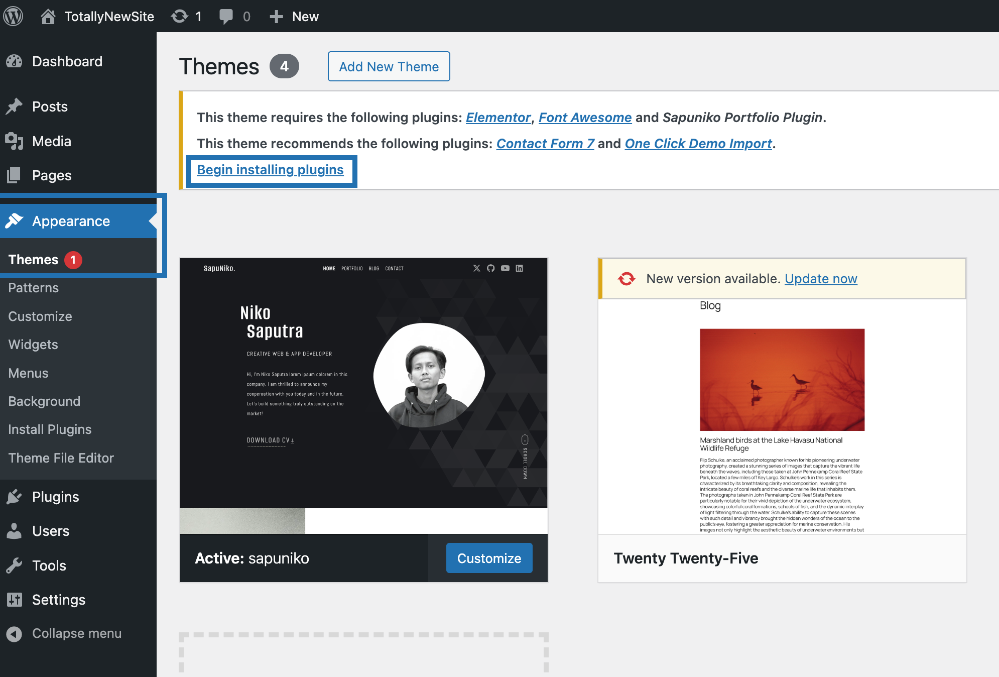
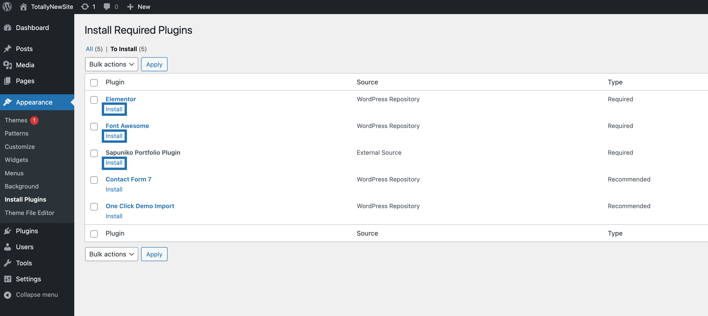
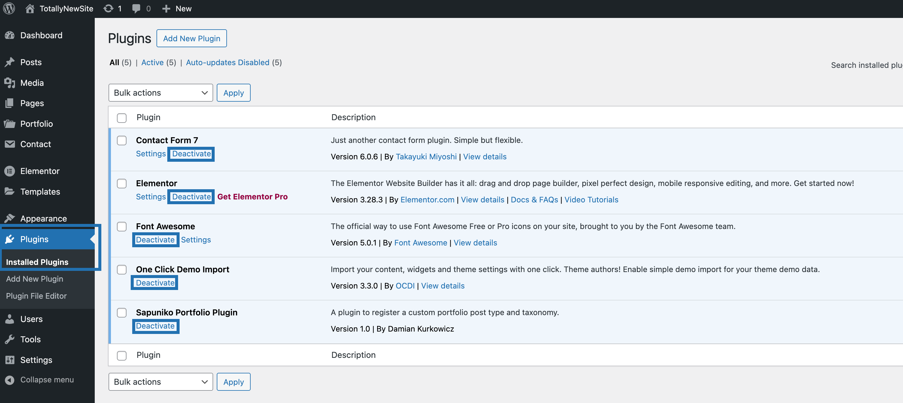
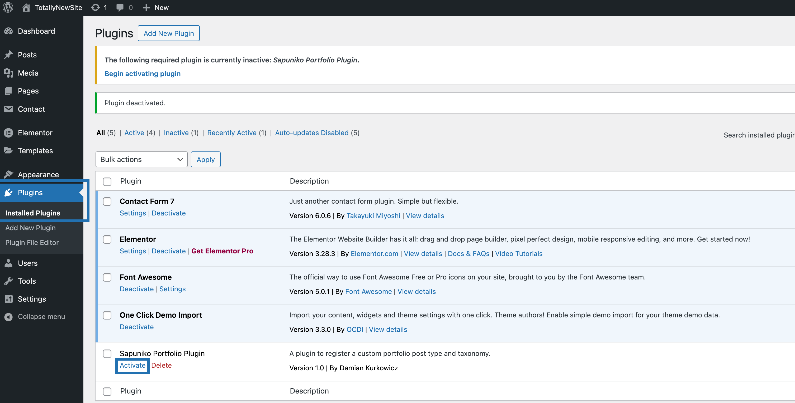

# Install Necessary Plugins

After installing the theme, you can see the plugin requirements in **Appearance -> Themes**

Most of them are required for the theme to function properly, but some are optional depending on your needs:

- **Contact Form 7** -> Add if you plan on using the Contact Section widget.
- **One Click Demo Import** -> Add if you want to use the demo import functionality

 
## Install and Activate the plugins

In **Appearance -> Themes** click on **Begin Installing Plugins**.
 

 

Install the required and the recommended (optional) plugins, depending on your needs.

You can always remove the recommended ones later.

**_IMPORTANT:_** **Install and activate the plugins one by one to prevent errors.**
 

 

After installing each plugin, check if they are activated properly.

In **Plugins -> Installed Plugins** check if the plugins are active by looking for a **Deactivate** button next to every plugin as shown here:

 

If some of the plugins were not activated, simply click on **Activate**:

