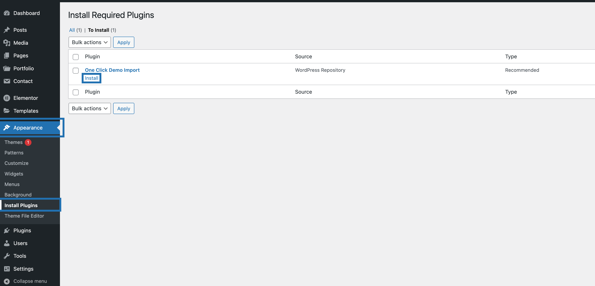
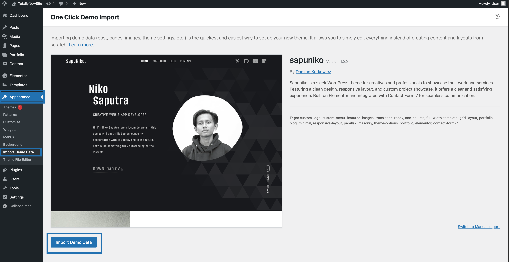
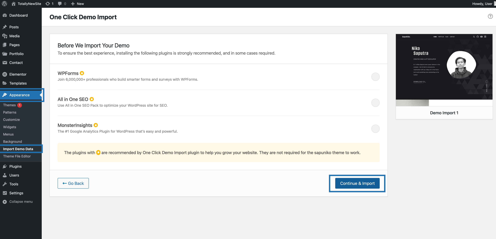
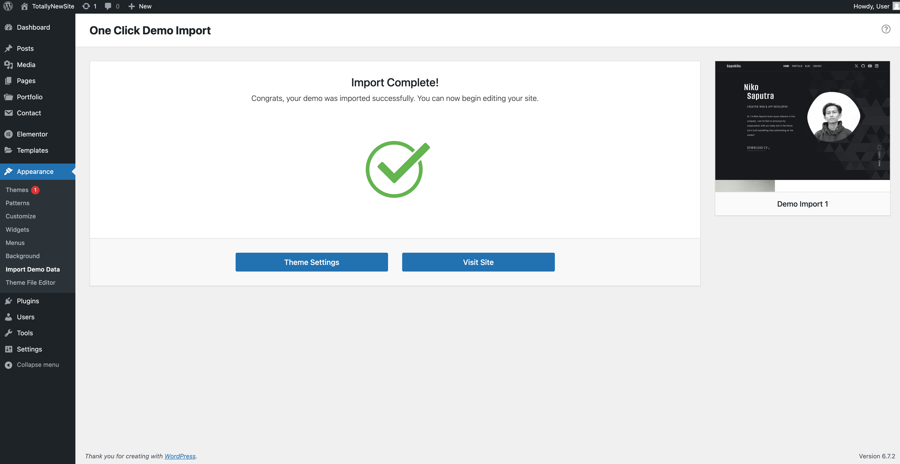

# Import the Demo Content

We strongly advise using One Click Demo Import to setup your website to simplify the process (even if you will change the demo content later).

## Activate One Click Demo Import plugin

If you haven't done so already, go to **Appearance -> Install Plugins**, then install and activate One Click Demo Import:

## Begin Import

Go to **Appearance -> Import Demo Data** and click **Import Demo Data**.

 
Afterwards, click **Continue & Import**. The import will take some time.

 
After the import completed you should see something like this:

