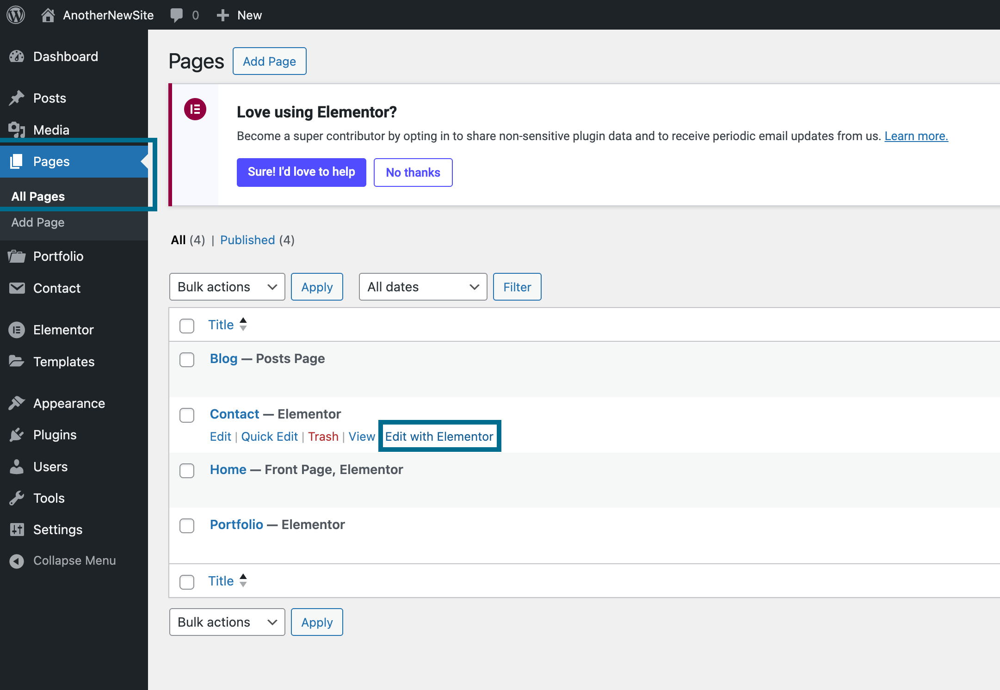
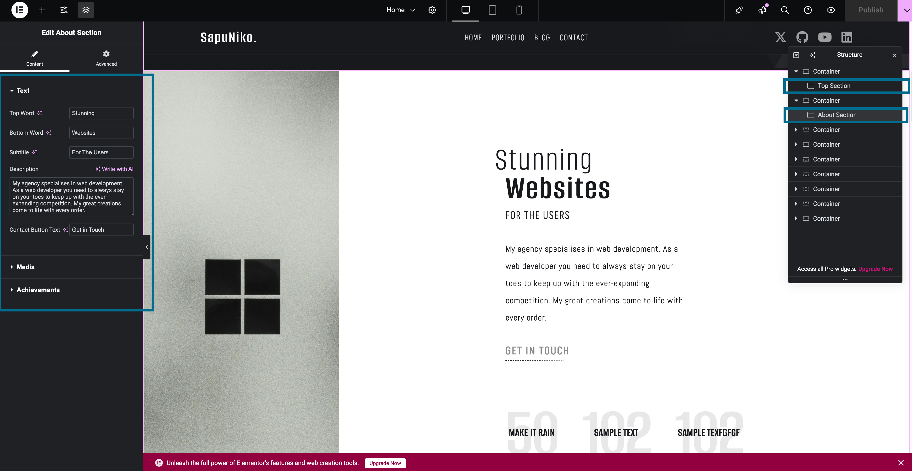
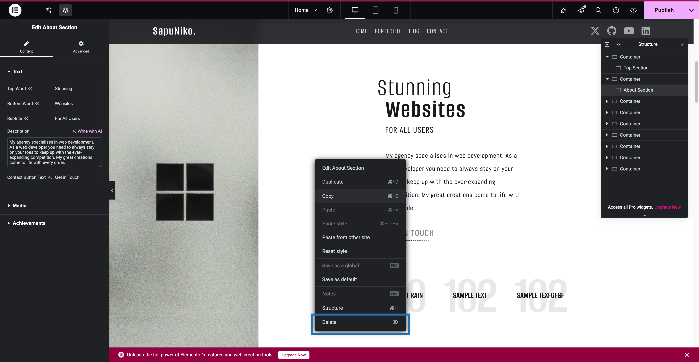
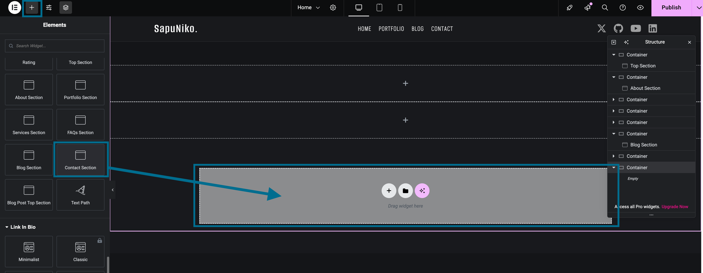

import changeOrderImg from "../../static/img/changeOrder.png";
import publishImg from "../../static/img/publish.png";

# Pages

Most pages should be edited using Elementor.

**_IMPORTANT:_** **Blog Page** and **Portfolio Page** should not be edited - they are post archives. You are still able to edit Blog Posts and Portfolio Posts as described below.

You can edit a page with Elementor like this:

 
## Editing Sections
Choose a section - either by clicking on it or choosing in **Structure Menu** on the right.
Edit the details of each section in the **Edit Section -> Content** on the left.

## Removing Sections

Right click on a section or choose it in **Structure Menu**. Then click **Delete**.

## Adding Sections

In order to add sections, click on the **+** icon in the top left corner, then choose a widget and drag it to the specified widget area.

**_IMPORTANT_** A full list of Sapuniko Elementor Sections/Widgets is on [this page](/docs/Content%20Customization/page-5).

## Changing Order of Sections

You can change the order of section by dragging them in **Structure Menu**:

## Publish

When you are done with the editing, **publish your changes**:

